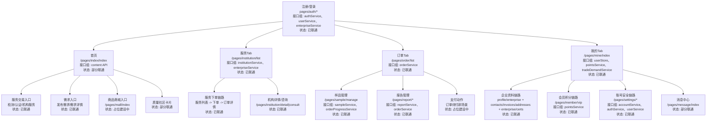
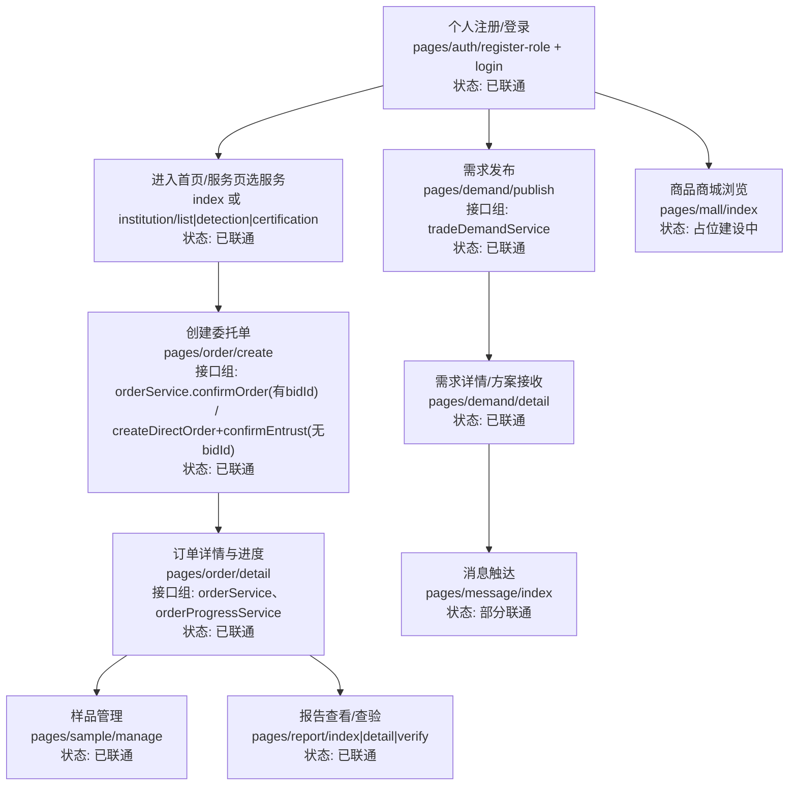
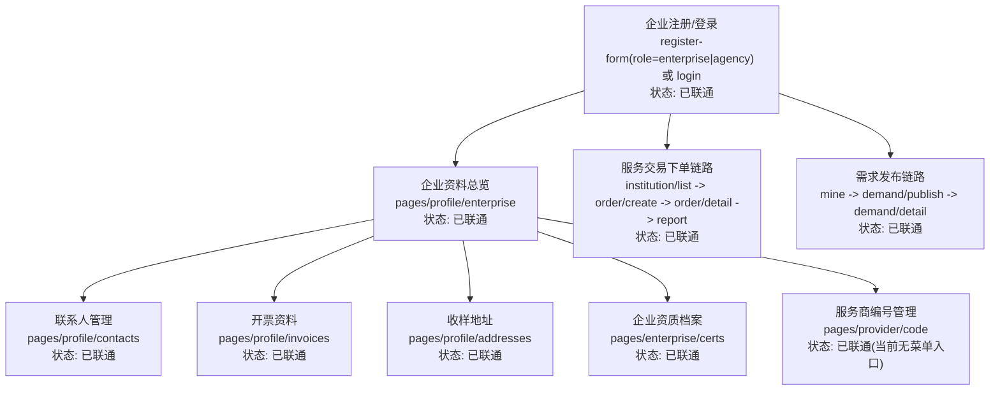
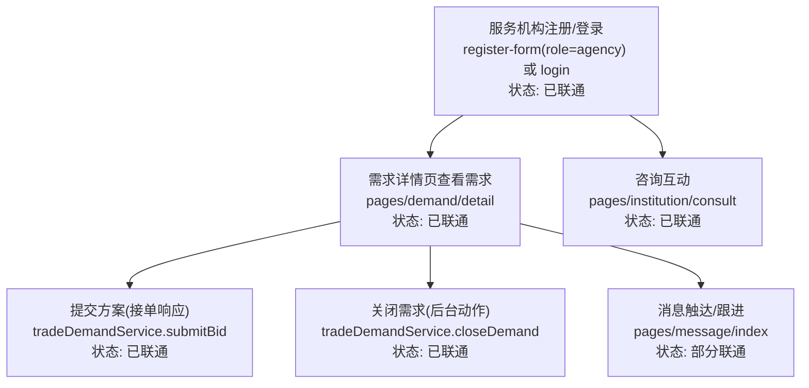
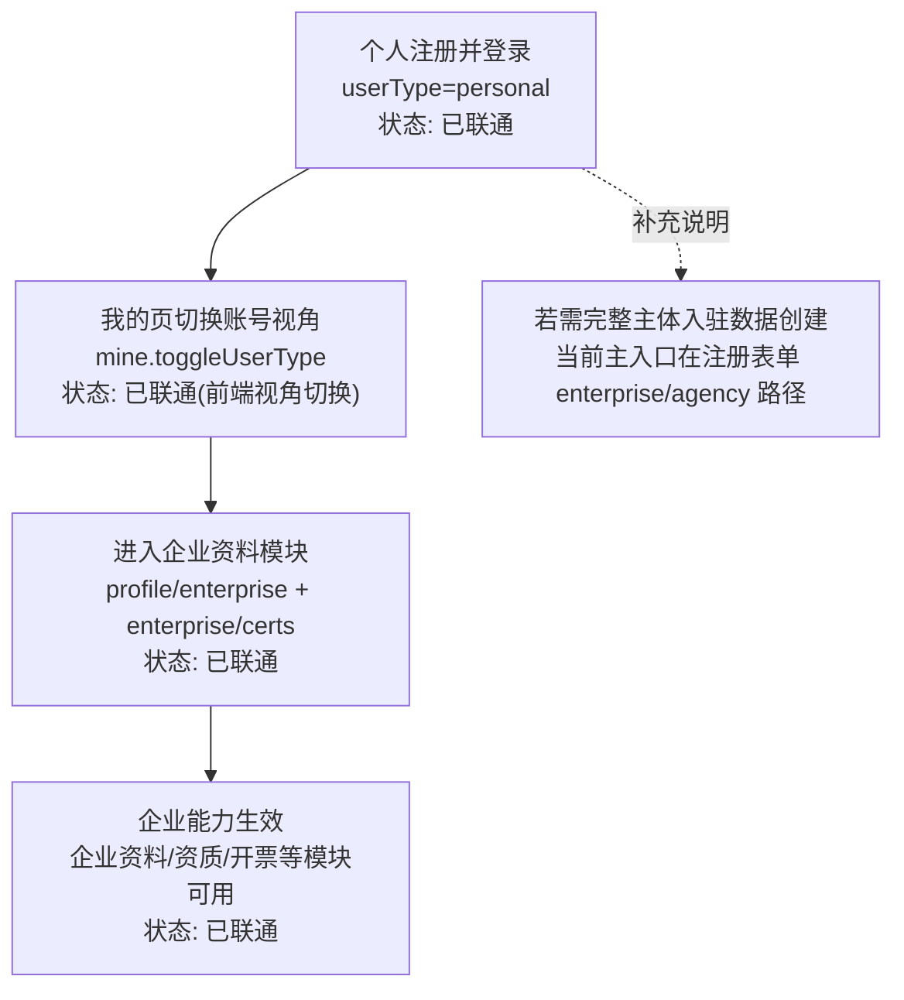

# 小程序整体流程设计图（全角色）

> 基于当前前端代码梳理（`src/pages`、`src/services/api`、`src/stores`）。  
> 口径：只描述“当前已实现事实”，不把规划能力当已上线。

## 1. 全局总图

## 2. 个人用户主流程图

## 3. 企业用户主流程图

## 4. 服务机构用户主流程图

## 5. 个人升级企业跨角色图

## 6. 关键节点清单（page path + 接口组 + 联通状态）

| 业务节点 | 页面入口（page path） | 核心接口组 | 联通状态 | 说明 |
| --- | --- | --- | --- | --- |
| 注册/登录 | `/pages/auth/register-role` `/pages/auth/register-form` `/pages/auth/login` `/pages/auth/wechat-profile` | `authService` `userService` `enterpriseService` `accountService` | 已联通 | 支持手机号/密码/微信小程序登录；微信登录先判定 `isNewUser`，仅新用户进入资料页并通过 `uploadWxAvatar + updateProfile` 完成资料回写 |
| 登录拦截 | 全局提交动作守卫 | `ensureLoggedInForSubmitAction` | 已联通 | 未登录时 `toast`，并自动跳转登录页 |
| 服务机构/服务项目浏览 | `/pages/institution/list` `/pages/service/index` `/pages/detection/index` `/pages/certification/index` | `institutionService` `enterpriseService` `inspectionItem` `certification` | 已联通 | 支持检索、筛选、跳转下单 |
| 委托下单 | `/pages/order/create` | `orderService.confirmOrder` `orderService.createDirectOrder` `orderService.confirmEntrust` | 已联通 | 混合链路：有 `bidId` 走 `confirmOrder`；无 `bidId` 走直连+寄样 |
| 订单与进度 | `/pages/order/list` `/pages/order/detail` | `orderService` `orderProgressService` | 已联通 | 支持查看、补录、评价等动作 |
| 样品管理 | `/pages/sample/manage` | `sampleService` `orderProgressService` | 已联通 | 支持异常、留样/退样登记 |
| 报告管理 | `/pages/report/index` `/pages/report/detail` `/pages/report/verify` | `reportService` `orderService` | 已联通 | 支持查看、防伪查验、下载链接复制 |
| 需求发布/响应 | `/pages/demand/publish` `/pages/demand/detail` | `tradeDemandService` | 已联通 | 支持发布需求、提交方案、关闭需求 |
| 企业资料链路 | `/pages/profile/enterprise` `/pages/profile/contacts` `/pages/profile/invoices` `/pages/profile/addresses` `/pages/enterprise/certs` | `enterpriseService` `profileService` | 已联通 | 发票/地址已接真实后端接口，支持默认项维护与读取 |
| 服务商编号 | `/pages/provider/code` | `providerService` | 已联通 | 页面可用，当前无显式菜单入口 |
| 账号与安全 | `/pages/settings/index` `/pages/settings/account` | `accountService` `authService` `userService` | 已联通 | 昵称/头像优先走 `account.updateProfile`，失败自动回退旧接口 |
| 会员积分 | `/pages/member/vip` | `pointsService` | 已联通 | 积分余额、规则、流水联通 |
| 消息中心 | `/pages/message/index` | 当前以本地消息展示为主 | 部分联通 | 页面可用，但非完整后端消息流闭环 |
| 商品商城 | `/pages/mall/index` | 当前无真实交易接口串联 | 占位建设中 | 仅展示/筛选，购买与购物车动作为“功能开发中” |
| 社区能力 | 首页“质量社区”卡片 | `content` 相关接口 | 部分联通 | 可拉取内容并 toast 预览，无独立社区页面闭环 |
| 支付主链 | 订单详情待付款动作 | 当前支付动作占位 | 占位建设中 | 待付款按钮目前为“支付能力建设中” |
